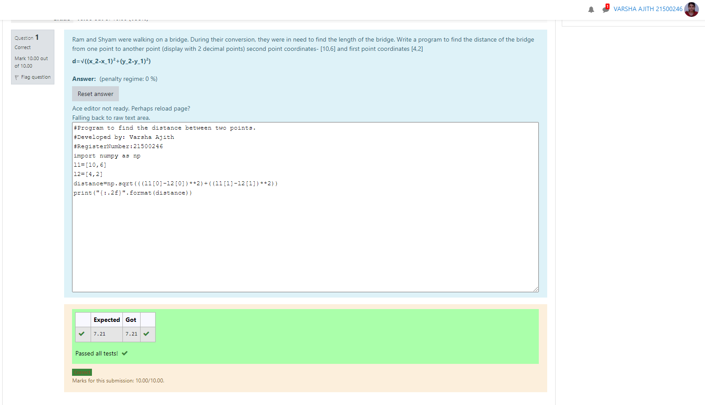

# DISTANCE-BETWEEN-TWO-POINTS

## AIM:
To write a python program to find the distance two 2 points
## ALGORITHM:
### Step 1: 
Import numpy module as np to use the built-in function for calcluating the distance between the two points.
### Step 2: 
Get the x1 and x2 values from the user to calculate the distance between the two points.
### Step 3: 
Substitute the values in the distance formula  
### Step 4: 
Print the distance between the two points in two decimal places by {:.2f} format.
### Step 5: 
End the program.
### PROGRAM:
```
#Program to find the distance between two points.
#Developed by: Varsha Ajith
#RegisterNumber:21500246
import numpy as np
l1=[10,6]
l2=[4,2]
distance=np.sqrt(((l1[0]-l2[0])**2)+((l1[1]-l2[1])**2))
print("{:.2f}".format(distance))
```
### OUTPUT:



### RESULT:
Thus, a python program to calculate the distance between the two points is executed successfully.
